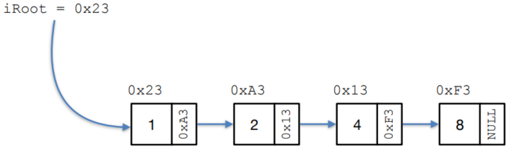
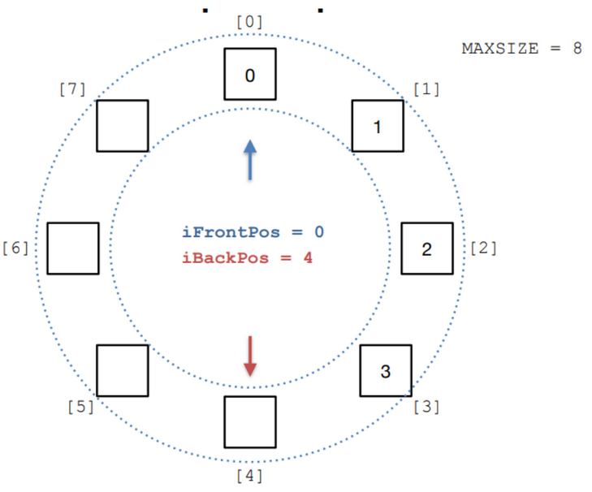
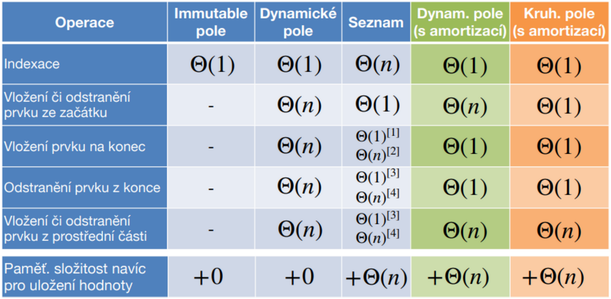
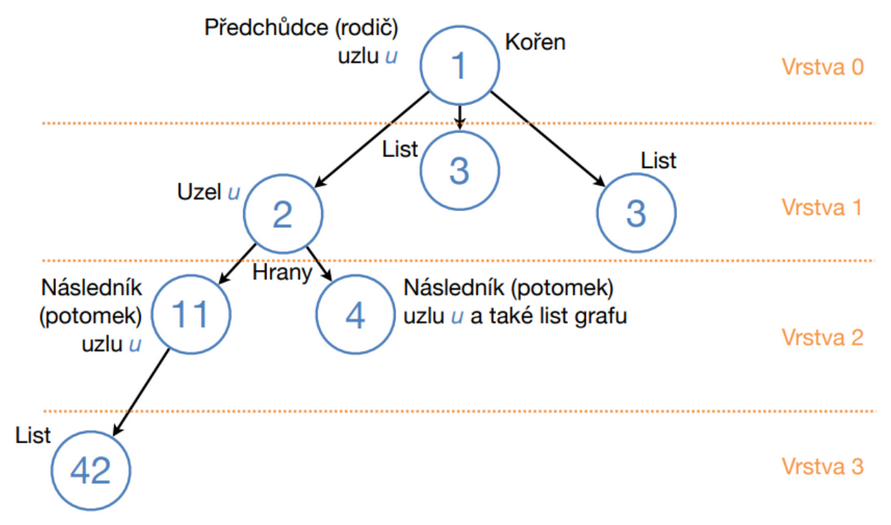
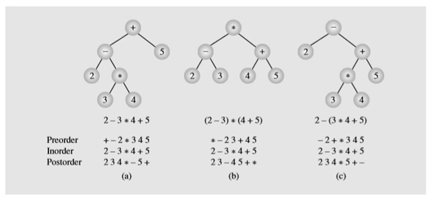

# Generic type shit
## Složitost algoritmu
- Horní odhad složitosti $O(f(n))$: maximální možný čas, který bude algoritmus potřebovat
- Dolní odhad složitosti $\Omega(f(n))$: minimální možný čas, který bude algoritmus potřebovat
- Těsná odhad složitosti $\Theta(f(n))$: pouze pokud se horní a dolní odhad shoduje

Výpočet časové složitosti je závislý na počtu cyklů

# Datatypes
### Kontejnery
- Immutable = bez možnosti přidávání/odebírání
- Mutable = v průběhu lze přidávat/odebírat<br><br>
- Ordered
- Unordered
### First calss citizen
- Lze jej přiřadit do proměnné
- Lze jej předat jako parametr funkce
- Lze jej vrátit z funkce
- Lze je porovnávat

## Lineární datové typy
### Immutable pole
`int array[MAXSIZE];`
- Nelze upravovat počet hodnot v poli
- Snadný přístup k libovolnému prvku

### Dynamické pole
```
struct TStack {
	size_t size;
	int values[MAXCOUNT];
};
```
- Vytvářeno dynamickou alokací paměti
- Není efektivní pro úpravu počtu hodnot - zvláště z prostředka
- Při úpravě počtu elementů se musí pole realokovat

### Dynamické pole s amortizací
```
#define UPPER_RESIZE
#define LOWER_RESIZE
struct TStack {
	size_t size;
	int values[MAXCOUNT];
};
```
- Vytvářeno dynamickou alokací paměti
- Není efektivní pro úpravu počtu hodnot - zvláště z prostředka
- Nechávají se prázdné elementy na konci
- Velikost se realokuje (zdvojnásobuje / zmenšuje na polovinu) až když `size > UPPER_RESIZE` nebo `size < LOWER_RESIZE`

### Vázaný seznam
```
struct linkedList {
    int data;
    struct linkedList *nextNode;
};
```
- Každý node obsahuje jeho hodnotu adresu následujícího prvku, poslení node má `struct linkedList *nextNode == NULL`
- Je potřeba znát adresu prvního nodu
- Je možné mít i odkaz na předchozí
- Práce je složitější - nemáme přístup k libovolnému prvku
- Vhodné pokud budeme častu přídávat/odebírat hodnoty uprostřed<br>



### Kruhové pole
```
struct circularBuffer {
	size_t frontPos;
	size_t backPos;
	int values[MAXSIZE];
};
```
- Obsahuje 2 ukazatele (na začátek a na konec)
- Lze snadno přidávat/odebírat ze začátku i konce
- `frontPos == backPos` -> pole je prázdné
- `frontPos == backPos + 1` -> pole je plné
- **Lze mít kruhové pole s amortizací**<br>



### Porovnání časové složitosti jednotlivých lineárních datových typů


### Zásobník
- LIFO (last in first out)
- Lze implementovat polem / vázaným seznamem

### Fronta
- FIFO (first in first out)
- Posuvný registr
- Implementace polem / lineárně vázaným seznamem
- **Obousměrná fronta:** lze vkládat a odebírat ze začátku i konce, implementace kruhovým polem
- **Prioritní fronta:** prvek je přidán před všechny prvky s nižsí prioritou, ale za všechny prvky se stejnou nebo vyšší prioritou

## Nelineární datové typy

- **Uzel:** prvek uvnitř listu, má předchůdce(rodič) i následníka(potomka)
- **Kořen:** vrchní prvek, nemá předchůdce
- **List:** spodní prvek, nemá potomka
- **Vrstva:** počet hran od kořene k danému listu
- **Výška strom:** počet hran na průchod z kořene k nejnižšímu listu

### Průchod stromem
- **Do šířky:** jde po vrstvách zleva
- **Pre-order:** jde po uzlech zvrchu a zleva
- **In-order:** jde po uzlech zleva a zvrchu, dá setřízenou posloupnost
- **Post-order:** jde po uzlech zleva a zespodu<br>


### Binární strom
```
struct Tree {
    int value;
    size_t height;
    struct Tree *left;
    struct Tree *right;
};
```
- Každý uzel má maximálně 2 následníky
- Vyvážený binární strom = všechny vrstvy mimo poslední maximální počet uzlů

### Binrary Heap
- Binární strom, kde jsou všechny vrstvy krom listové plně zaplněny (ta je zaplněná zleva)
- **Maxheap:** rodič má vždy vyšší hodnotu než potomek
- **Minheap:** rodič má vždy nižší hodnotu než potomek

### Množina
- Nesetříděné prvky, z nichž každý může být obsažen pouze 1

# Vyhledávání
- **Stabilní třízení:** Stejné prvky jsou zachovány v půvpdním pořadí
- **Nestabilní třízení:** Stejné prvky mohou být přehazovány<br><br>
- **In-place:** třízení probíhá v prostoru paměti třízených dat
- **Out-of-place:** je potřeba vnější 

## Insert sort
- Postupně posouváme každý prvek dokud není menší než předchozí prvek<br>
```
5|2 4 1 3
^-^
2 5|4 1 3
  ^-^
2 4 5|1 3
    ^-^
2 4 1 5|3
  ^-^
2 1 4 5|3
^-^
1 2 4 5|3
      ^-^
1 2 4 3|5
    ^-^
1 2 3 4 5
```

## Bubble sort
- Největší prvek probublává vzhůru
- Postupně porovnáváme dvojice sousedních prvků a v případě špatného pořadí swapujeme
- Největší se při každém průchodu dostane na konec -> při dalším průchodu můžeme skončit o prvek dříve
- Optimalizace možná ukončením pokud nedojde k žádné výměně<br>
1. průchod
```
5 2 4 1 3
^-^
2 5 4 1 3
  ^-^
2 4 5 1 3
    ^-^
2 4 1 5 3
      ^-^
2 4 1 3 5
```
2. průchod
```
2 4 1 3|5
  ^-^
2 1 4 3 5
    ^-^
2 1 3|4 5
```
3. průchod
```
2 1 3|4 5
^-^
1 2 3 4 5
```

## Shaker sort
- obdoba bubble sortu, ale střídá směr z vrchu a zespodu
1. průchod nahoru
```
5 2 4 1 3
^-^
2 5 4 1 3
  ^-^
2 4 5 1 3
    ^-^
2 4 1 5 3
      ^-^
2 4 1 3|5
```
2. průchod dolů
```
2 4 1 3|5
  ^-^
2 1 4 3|5
^-^
1|2 4 3|5
```
3. průchod nahoru
```
1|2 4 3|5
    ^-^
1 2 3 4 5
```

## Select sort
- Hledá index minima v celé nesetřízené oblasti a ten na konci swapne s prvním nesetřízeným prvkem
- V ukázce indexace od 0
```
5 2 4 1 3 -> [3]
^-----^
1 2 4 5 3 -> [1]
  ^
1 2 4 5 3 -> [4]
    ^---^
1 2 3 5 4 -> [3]
      ^-^
1 2 3 4 5
```

## Porovnání třídících algoritmů
