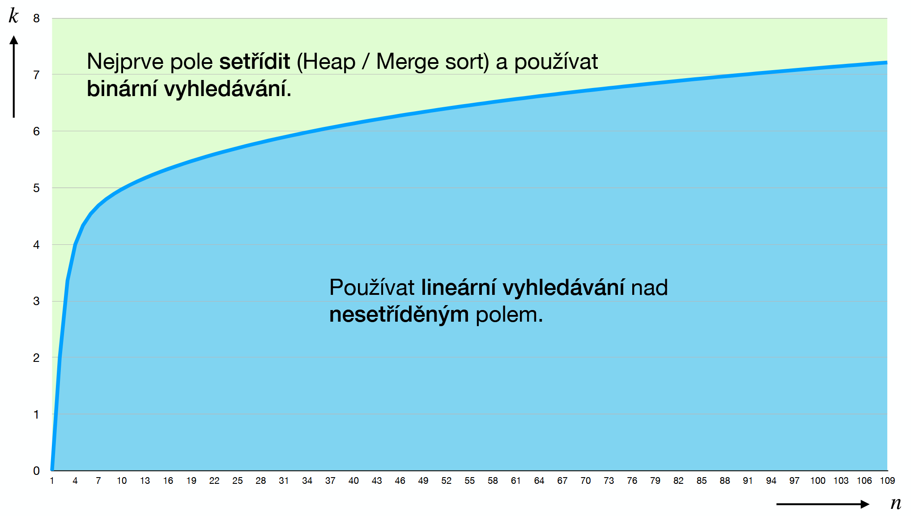
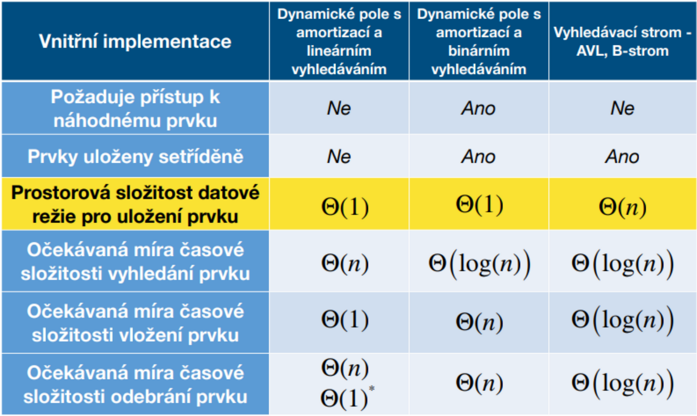
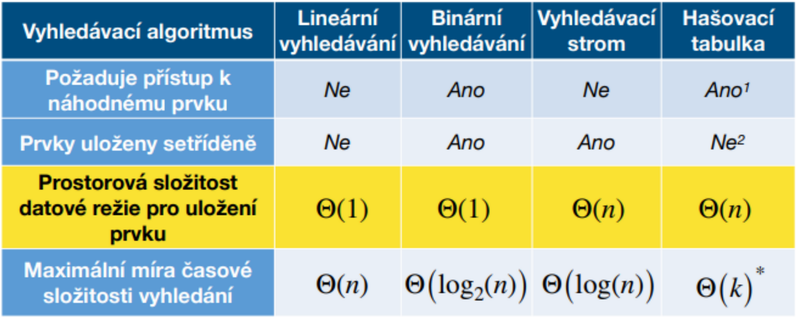

[<- Back](Zkouska.md)
# Vyhledávání
- Od kdy je lepší nejprve setřídit a pak až vyhledávat<br>


## Linear probing
- Postupně prochází lineární seznam/pole dokud nenajde požadovaný prvek, nebo nedojde na konec = hledaný prvek tam není
- Množina je z pravidla nesetříděná (ale není to nutné)

## Binární vyhledávání
- Vyžaduje setříděnou množinu
- využívá metody postupné aproximace půlením intervalu

## Binary search tree
- Využívá binární strom
- Sestaví se z množiny *in-order* průchodem
- **Vyšší hledaná hodnota:** posun doleva dolů
- **Nižší hledaná hodnota:** posun doprava dolů
```
1 2 4 5 7 8 15 28 31 39
// Hledáme: 15

       |7|              //  7 < 15 -> doprava
    /       \
   2       |28|         // 28 > 15 -> doleva
  / \      /  \
 1   4   |8|  31        //  8 < 15 -> doprava
      \    \    \
       5  |15|  39      // 15 = 15 -> máme hodnotu       
```

## AVL strom
- Binární strom se speciálními pravidly vyváženosti
- Vyváženost je pouze když výška jednoho podstromu uzlu je maximálně o 1 vyšší než druhá
- Pro vyvážení je možné použít rotace: PP, LL, PL, LP
```
     g 
    / \
  |f|  D   
  / \ 
 A  |e|
    / \
   B   C
// LL rotace prvků f-e
     |g| 
     / \
   |e|  D   
   / \ 
  f   C
 / \
A   B
// PP rotace prvků e-g
      e 
   /     \
  f       g   
 / \     / \
A   B   C   D

```

## B strom
- Údajně nebude na zkoušce, tak se s ním nebudu zabývat

## SkipList
- Ze slova Skip v názvu této vyhledávací metody je patrné, že se má skipnout, neboli přeskočit
- Vzhledem k tomu že tato metoda využívá náhodu, tak i já toto nechám na náhodu

## Hashování
- Pro složité řeťezce se podle zadané funkce vypočítá krátký klíč
- Existuje tabulka klíčů - Hash table, ve které vyhledáváme
- Pro stejný řetězec vyjde vždy stejný klíč
- Z klíče nejde řetězec zpětně sestavit
- Více hodnotám může vyjít stejný hash = kolize (otevřené adresování, řetězení)
### Otevřené adresování
- Pokud je již hodnota v hashovací tabulce obsazená, hledá se další volná pozice
- **Linear probing:** index se zvyšuje o 1, možný vznik shluků
- **Quadratic probing:** index se zvyšuje kvadraticky, snižuje možnost vzniku shluků
- **Dvojité hashování:**
- Musí existovat označení smazaného prvku *deleted* - pokud bychom vymazali první prvek s daným hashem, při hledání dalšího prvku se stejným hashem narazíme na prázdné místo -> jakoby tam prvek nebyl -> konec hledání. Pokud narazíme na *deleted*, hledáme dál

### Řetězení
- Pokud dojde ke kolizi, nový prvek se přidá za stávající
- Při vyhledávání spočítáme hash a poté lineárně procházíme seznam prvků na daném místě hash tabulky

## Porovnání vyhledávacích funkcí

