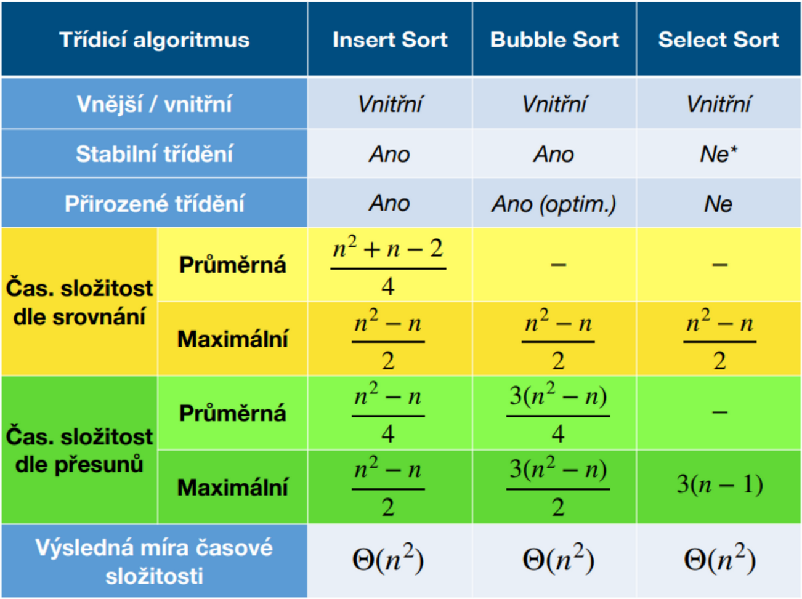
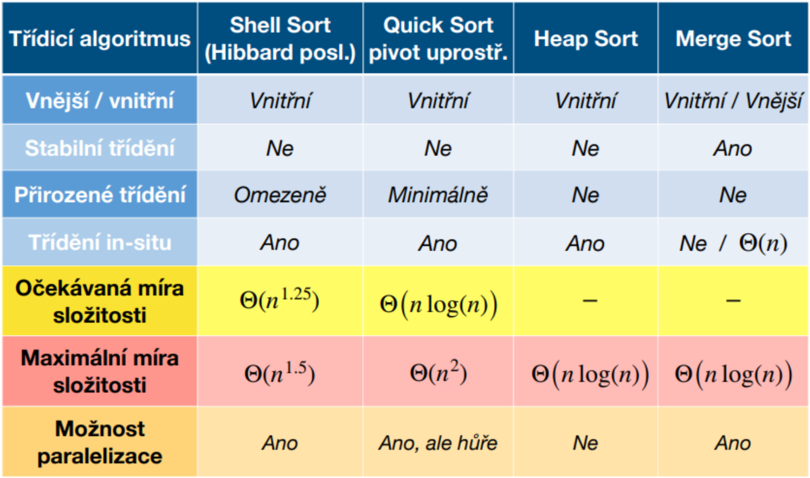

[<- Back](Zkouska.md)
# Třídění
- **Stabilní třízení:** Stejné prvky jsou zachovány v půvpdním pořadí
- **Nestabilní třízení:** Stejné prvky mohou být přehazovány<br><br>
- **In-place:** třízení probíhá v prostoru paměti třízených dat
- **Out-of-place:** je potřeba vnější<br><br>
- **^=^:** operátor porovnání bez prohození
- **^-^:** operátor porovnání s prohozením

## Insert sort
- Postupně posouváme každý prvek dokud není menší než předchozí prvek<br>
```
5|2 4 1 3
^-^
2 5|4 1 3
  ^-^
2 4 5|1 3
^=^
2 4 5|1 3
    ^-^
2 4 1 5|3
  ^-^
2 1 4 5|3
^-^
1 2 4 5|3
      ^-^
1 2 4 3|5
    ^-^
1 2 3 4|5
  ^=^
1 2 4 3|5
^=^
```

## Bubble sort
- Největší prvek probublává vzhůru
- Postupně porovnáváme dvojice sousedních prvků a v případě špatného pořadí swapujeme
- Největší se při každém průchodu dostane na konec -> při dalším průchodu můžeme skončit o prvek dříve
- Optimalizace možná ukončením pokud nedojde k žádné výměně<br>
```
5 2 4 1 3
^-^
2 5 4 1 3
  ^-^
2 4 5 1 3
    ^-^
2 4 1 5 3
      ^-^
2 4 1 3|5
^=^
2 4 1 3|5
  ^-^
2 1 4 3|5
    ^-^
2 1 3|4 5
^-^
1 2 3|4 5
  ^=^
1 2|3 4 5
^=^
```

## Shaker sort
- obdoba bubble sortu, ale střídá směr z vrchu a zespodu
```
5 2 4 1 3
^-^
2 5 4 1 3
  ^-^
2 4 5 1 3
    ^-^
2 4 1 5 3
      ^-^
2 4 1 3|5
    ^=^
2 4 1 3|5
  ^-^
2 1 4 3|5
^-^
1|2 4 3|5
  ^=^
1|2 4 3|5
    ^-^
1 2|3|4 5
```

## Select sort
- Hledá index minima v celé nesetřízené oblasti a ten na konci swapne s prvním nesetřízeným prvkem
- V ukázce indexace od 0
```
5 2 4 1 3 -> [3]
^-----^
1 2 4 5 3 -> [1]
  ^
1 2 4 5 3 -> [4]
    ^---^
1 2 3 5 4 -> [3]
      ^-^
1 2 3 4 5
```

## Shell sort
- Insert sort na steroidech
- Oblasti se dělí na polovinu
```
8 5 3 1|4 7 6 2
^-------^
4 5 3 1|8 7 6 2
  ^=======^
4 5 3 1|8 7 6 2
    ^=======^
4 5 3 1|8 7 6 2
      ^=======^
4 5|3 1|8 7|6 2
^---^
3 5|4 1|8 7|6 2
  ^---^
3 1|4 5|8 7|6 2
        ^---^
3 1|4 5|6 7|8 2
          ^---^
3|1 4 5 6 2 8 7   // odtud classic insert sort
^-^
1 3|4 5 6 2 8 7
  ^=^
1 3 4|5 6 2 8 7
    ^=^
1 3 4 5|6 2 8 7
      ^=^
1 3 4 5 6|2 8 7
        ^-^
1 3 4 5 2 6|8 7
      ^-^
1 3 4 2 5 6|8 7
    ^-^
1 3 2 4 5 6|8 7
  ^-^
1 2 3 4 5 6|8 7
          ^=^
1 2 3 4 5 6 8|7
            ^-^
1 2 3 4 5 6 7 8
```

## Quick sort
- Prvek vždy porovnáváme s pivotem. Nalevo musí být menší, napravo větší.
- Hledáme index prvního prvku na kažné straně který danou podmínku nesplňuje.
- Pokud index dorazí na index pivota, zastaví se na něm, lze prohazovat i s pivotem
- Pokud se indexy překříží, volá se rekurentě na poloviny částí
```
7 1 9|5|4 8 3 2
^-------------^
2 1 9|5|4 8 3 7
    ^-------^
2 1 3|5|4 8 9 7
      ^-^
2 1 3 4|5|8 9 7        // indexy se překřížili -> rekurze na poloviční pole
2|1|3 4   5|8|9 7
^-^         ^---^
1|2 3 4   5 7 9|8|     // indexy se překřížili -> rekurze na poloviční pole
1 2   3 4   5 7   9 8
                  ^-^
1 2 3 4 5 7 8 9
```

## Heap sort
- Využívá binární strom (heap)
- Strom se postaví do šířky
- Zrotuje se tak, aby byl vyvážený
- Horní prvek se umístí do setřídědého pole a nahradí se posledním, tak aby bylo dodrženo pravidlo vyváženého binárního stromu
- Opakuje se dokud není strom prázdný
```
Sorry je to až moc veliký na demonstraci, a já na to fakt nemám čas a náladu
```

## Merge sort
- Dělíme množinu na poloviny dokud nezbydou dvojice (jednotlive prvky)
- Prvky ve dvojicích setřídíme
- Poté části spojujeme tak, že vybíráme vždy menší prvek z jejich počátků
```
   7 1 9 5 4 8 3 2
  7 1 9 5   4 8 3 2
7 1   9 5   4 8   3 2
^-^   ^-^   ^=^   ^-^
1 7   5 9   4 8   2 3
  1 5 7 9   2 3 4 8
   1 2 3 4 5 7 8 9
```

## Porovnání třídících algoritmů

